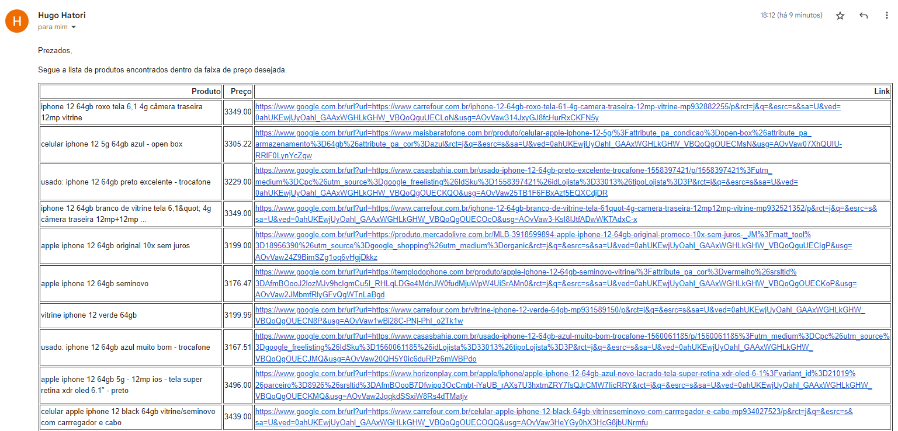

# Deal Seeker Web Scraping

## Project Scenario Description

Being responsible for researching the best prices for the company's inputs and products, it is necessary
to constantly search suppliers websites for the products available and the price, after all, each of them
may have promotions at different times and with different values.

For this project we will be using Google Shopping and Buscapé for price research.

### Packages used:
+ selenium
+ webdriver_manager
+ pandas
+ win32com.client
+ time

## Project's Objective

To create a Python Script capable of accessing suppliers websites and evaluate products prices based on
a previously established threshold, finding the cheapest products and updating the data in a spreadsheet.
And at last automatically sending the e-mail containing the best offers.

## Project's Input

This project utilizes an Excel file (buscas.xlsx) as an input. The Excel file contains 4 columns:
Product Name, Banned Words, Minimum Price and Maximum Price. So the research is customizable through this Excel
file by altering each row to the user's need.

## End Result

The project's output will be an Excel file and a e-mail containing a dataframe with 3 columns of information:
Product Name (as advertised on site), Product's Price and the URL.

 Note: this is a project developed for academic purposes, therefore this Project's Scenario is fictitious.
